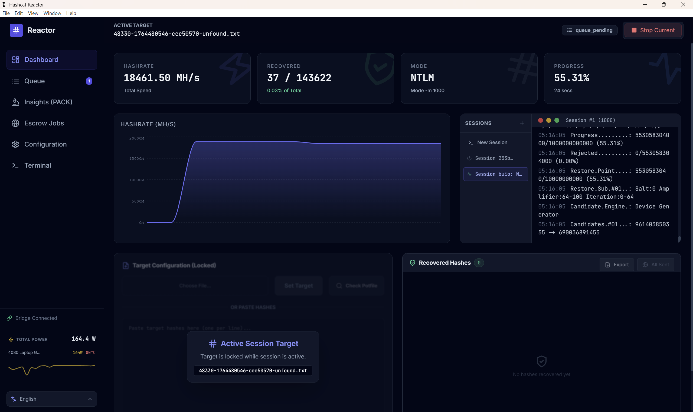
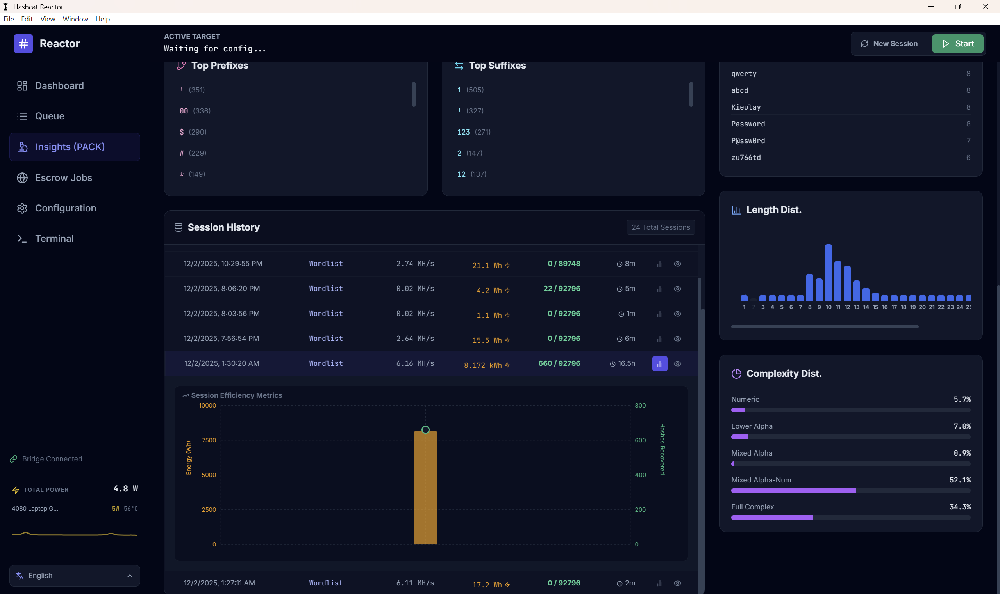
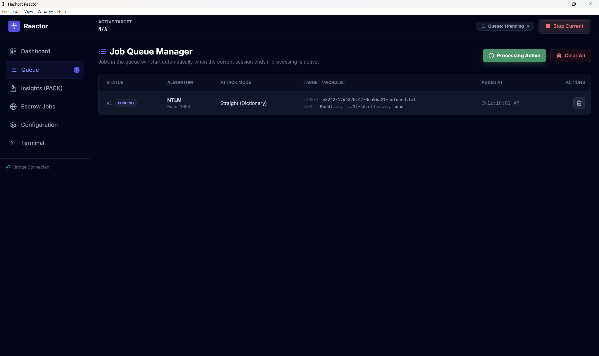
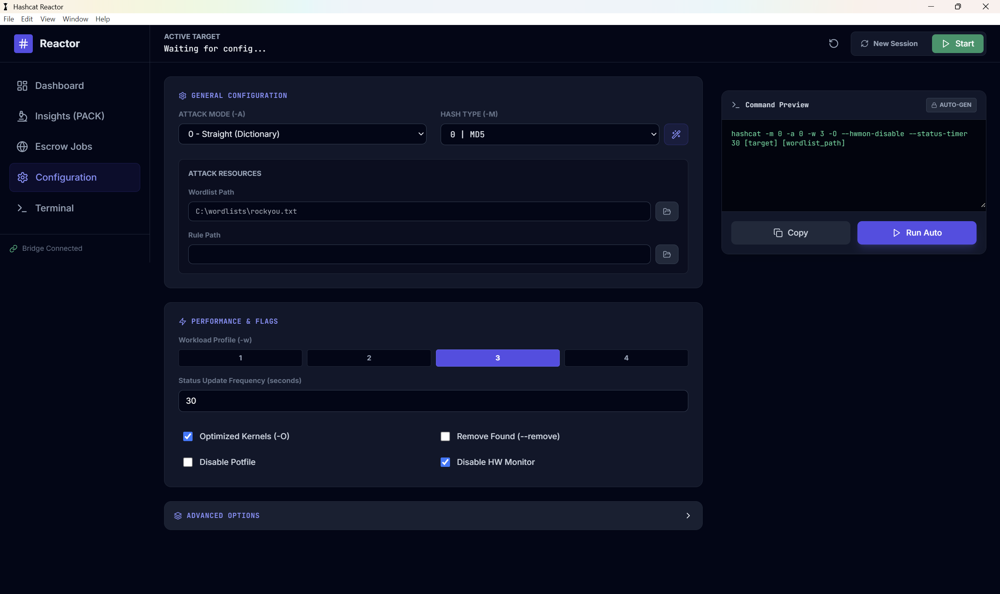
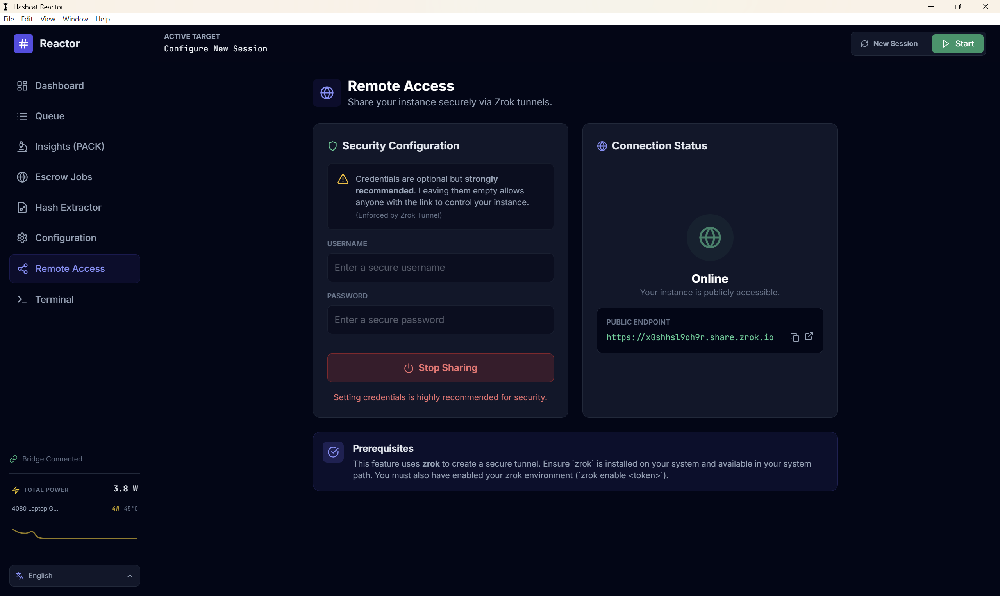
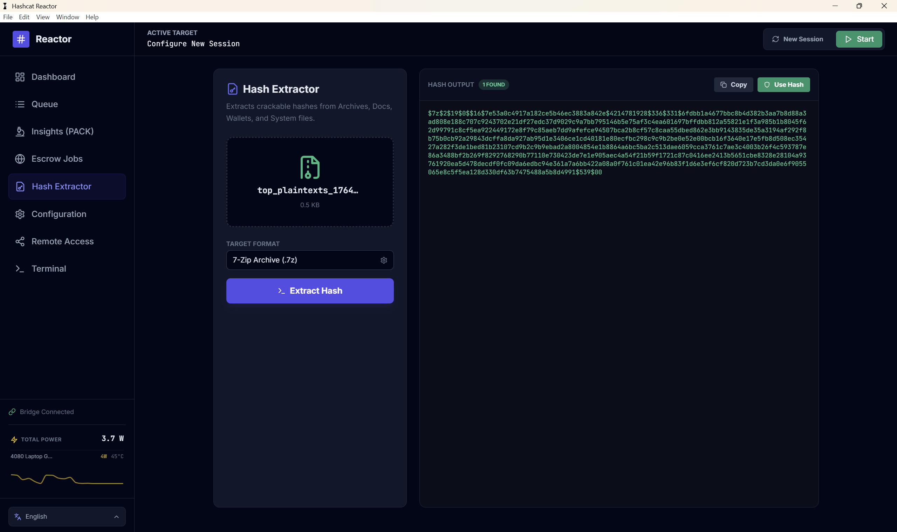

# Hashcat Reactor

**Hashcat Reactor** is a modern, high-performance GUI frontend for Hashcat, built specifically for **Windows**. It transforms the command-line experience into a visual dashboard with advanced analytics, job queuing, real-time monitoring, and intelligent attack automation.

## 🚀 Features

* **Real-time Dashboard**: Monitor hashrates, progress, and recovered hashes live via WebSockets.
* **Remote Access**: Securely share your instance over the web via Zrok tunnels to control it remotely.
    * *Security*: Supports optional username/password protection.
* **Hash Extractor**: Extracts crackable hashes directly from Archives (7-Zip, etc.), Documents, Wallets, and System files.
* **Job Queue System**: Queue up multiple attacks (Wordlist, Mask, Hybrid, etc.) and let Reactor process them sequentially automatically.
* **Advanced Insights (PACK)**: Integrated Password Analysis and Cracking Kit implementation. Analyzes your cracked hashes to generate optimized masks, identify top password patterns, charsets, and entropy data.
* **Smart Potfile Management**:
    * **Pre-Crack Analysis**: Check target lists against your potfile *before* starting an attack to see what is already cracked.    
* **Interactive Terminal**: Full pseudo-terminal (PTY) access to the underlying shell for manual overrides or running custom Hashcat commands directly from the GUI.
* **Multi-Language Support**: Fully localized interface available in **English** and **Chinese (中文)**.
* **Hardware Monitoring**: Real-time GPU temperature and power usage tracking.
    * *Note: Power draw metrics currently support **NVIDIA GPUs** only via `nvidia-smi`.*
* **Escrow Integration & Auto-Uploads**: 
    * Built-in module to submit cracked hashes to remote escrow APIs (hashes.com).
    * **Auto-Upload**: Automatically upload recovered hashes when a set threshold is reached (e.g., every 10 hashes). Features smart detection to match running sessions to the correct Hashes.com algorithm ID.
* **Session History**: Tracks all past attacks, their configurations, and success rates for future reference.

---

## 📸 Screenshots

| Dashboard | Insights & Analysis |
|:---:|:---:|
|  |  |
| *Real-time monitoring and controls* | *Detailed password pattern analysis* |

| Queue Manager | Interactive Terminal |
|:---:|:---:|
|  |  |
| *Automated job scheduling* | *access all the features* |

| Remote Access | Hash Extractor |
|:---:|:---:|
|  |  |
| *Secure remote tunneling via Zrok* | *Extract hashes from files* |

| Auto-Upload Settings | |
|:---:|:---:|
|  | |
| *Automated submission to Escrow* | |

---

## 🛠 Prerequisites

* **Operating System**: Windows 10/11 (64-bit).
* **Node.js**: Version 16.x or higher (LTS recommended).
* **Build Tools**: You generally need C++ build tools for `node-pty` to compile.
    * Run in an Admin PowerShell: `npm install --global --production windows-build-tools`.
* **Hashcat Binaries**: You must provide your own Hashcat executables.
* **Zrok (For Remote Access)**:
    * To use the **Remote Access** feature, `zrok` must be installed on your system and available in your system path.
    * You must have your zrok environment enabled using `zrok enable <token>`.
	* Visit zrok's website for installation guide https://docs.zrok.io/docs/guides/install/

---

## ⚙️ Installation & Build

This project is designed to be built for Windows.

1.  **Clone the repository**:
    ```bash
    git clone https://github.com/jjsvs/Hashcat-Reactor.git
    cd hashcat-reactor
    ```

2.  **Install Dependencies**:
    ```bash
    npm install
    ```

3.  **Configure Hashcat**:
    The application looks for Hashcat in a specific directory. You must place the binaries manually before building.
    
    1.  Create the folder structure inside the `backend` folder:
        ```
        backend/hashcat/
        ```
    2.  Download **Hashcat binaries** (v6.2.6 or higher) from the [official website](https://hashcat.net/hashcat/).
    3.  Extract the contents (specifically `hashcat.exe` and its dependencies) into `backend/hashcat/`.
    4.  Verify the path: `backend/hashcat/hashcat.exe` should exist.
	5.  V-7.1.2 is already included by default in the backend folder its upto you which version you want to use.

4.  **Build the Executable**:
    This will compile the React frontend, the backend, and package everything into a `.exe` installer.
    ```bash
    npm run electron:build
    ```
    *The output installer will be located in the `dist` folder.*.

---

## 💬 Community & Support

Join our community to discuss, request features, or get help with setup.

[**Join the Discord Server**](https://discord.gg/cpAFXhGtbN)

---

## ☕ Support the Development

If Hashcat Reactor helps you in your workflow or research, consider supporting the development.

* **Bitcoin (BTC):** `bc1qwcnky8a8zwzc3kec9ptl8cwvr6lmudnzdejzc0`
* **Monero (XMR):** `42RyienngNpVtGhBMBw8F6XTZwuky5V7R7dippJbhJgjKiBk75vKmeu7zJUznxSk5C6LsyYz2Cz2XJBttSXiWLuPUhRtTpa`
* **Litecoin (LTC):** `ltc1qlc5glj4qva85rvqjs085ww6gtk55zm4kpvg4cg`

---
