# Hashcat Reactor

**Hashcat Reactor** is a modern, high-performance GUI frontend for Hashcat. Originally built for **Windows**, it now runs cross-platform on **Windows, Linux, and macOS** (see [Platform Support](#-platform-support-windows--linux--macos)). It transforms the command-line experience into a visual dashboard with advanced analytics, job queuing, real-time monitoring, and intelligent attack automation.

## 🚀 Features

* **Real-time Dashboard**: Monitor hashrates, progress, and recovered hashes live via WebSockets.
* **Remote Access**: Securely share your instance over the web via Zrok tunnels to control it remotely.
    * *Security*: Supports optional username/password protection.
* **Hash Extractor**: Extracts crackable hashes directly from Archives (7-Zip, etc.), Documents, Wallets, and System files.
* **Job Queue System**: Queue up multiple attacks (Wordlist, Mask, Hybrid, etc.) and let Reactor process them sequentially automatically.
* **Smart Workflow**: A fully automated, multi-phase cracking pipeline that adapts to your results in real time.
    * **Phase 1 — Dictionary Attack**: Runs your selected wordlist (optionally with a rule) as the opening pass.
    * **Phase 2 — Dynamic Asset Generation**: Analyzes the hashes cracked in Phase 1 to auto-generate optimized masks and rules.
    * **Phase 3 — Targeted Mask Attack**: Runs the generated `.hcmask` with a configurable time budget, mask prioritization (occurrence vs. efficiency), length filtering, increment mode, and hard runtime caps. Auto-detects live hashrate to pre-select the masks that fit your budget.
    * **Phase 4 — Feedback Rule Attack**: Mutates the cracked plaintexts with the generated rules plus any custom rule files you add, running them as extra sequential passes.
    * **Hash-type aware**: Warns when a hash type is too slow for full workflow and can auto-set a sensible Phase 3 cap; global settings (workload, devices, `-O`, etc.) are inherited from the Config tab. Can be started immediately or added to the job queue.
* **Advanced Insights (PACK)**: Integrated Password Analysis and Cracking Kit implementation. Analyzes your cracked hashes to generate optimized masks, identify top password patterns, charsets, and entropy data.
* **Smart Potfile Management**:
    * **Pre-Crack Analysis**: Check target lists against your potfile *before* starting an attack to see what is already cracked.    
* **Interactive Terminal**: Full pseudo-terminal (PTY) access to the underlying shell for manual overrides or running custom Hashcat commands directly from the GUI.
* **Multi-Language Support**: Fully localized interface available in **English** and **Chinese (中文)**.
* **Hardware Monitoring**: Real-time GPU temperature and power usage tracking.
    * *Note: Power draw metrics currently support **NVIDIA GPUs** only via `nvidia-smi`.*
* **Escrow Integration & Auto-Uploads**: 
    * Built-in module to submit cracked hashes to remote escrow APIs (hashes.com).
    * **Auto-Upload**: Automatically upload recovered hashes when a set threshold is reached (e.g., every 10 hashes). Features smart detection to match running sessions to the correct Hashes.com algorithm ID.
* **Session History**: Tracks all past attacks, their configurations, and success rates for future reference.

---

## 📸 Screenshots

| Dashboard | Insights & Analysis |
|:---:|:---:|
| 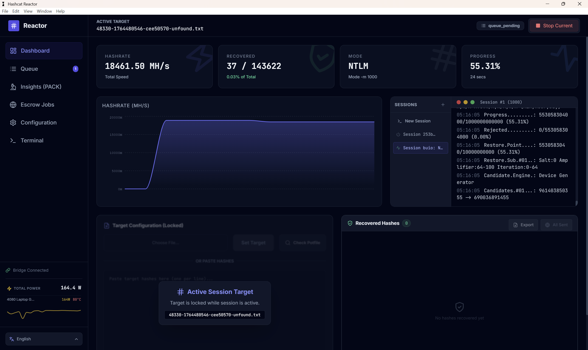 | 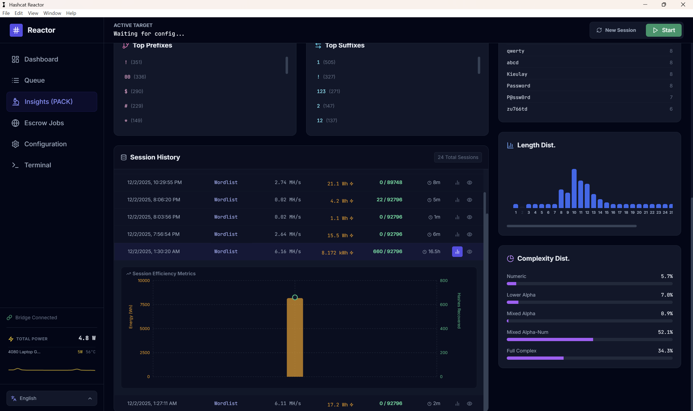 |
| *Real-time monitoring and controls* | *Detailed password pattern analysis* |

| Queue Manager | Interactive Terminal |
|:---:|:---:|
| 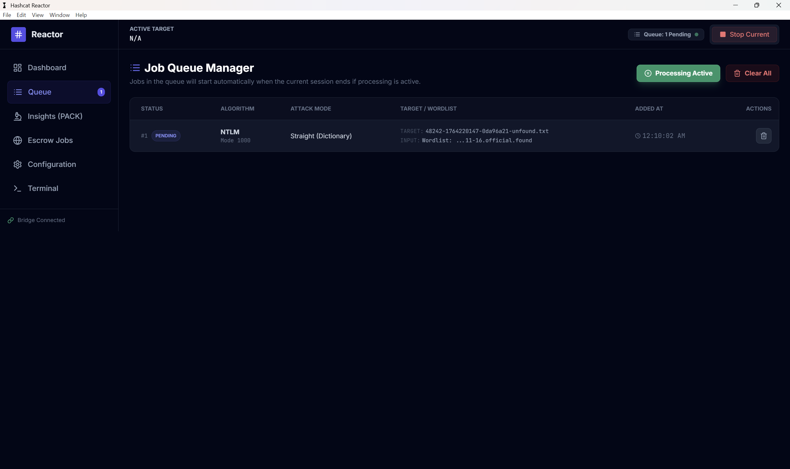 | 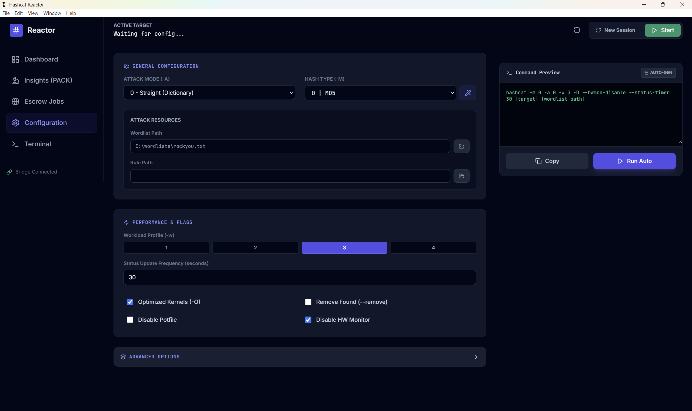 |
| *Automated job scheduling* | *access all the features* |

| Remote Access | Hash Extractor |
|:---:|:---:|
| 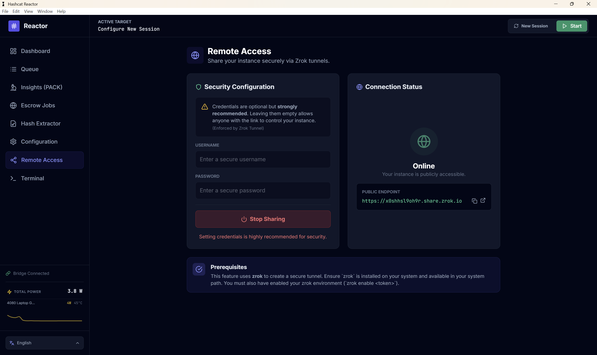 | 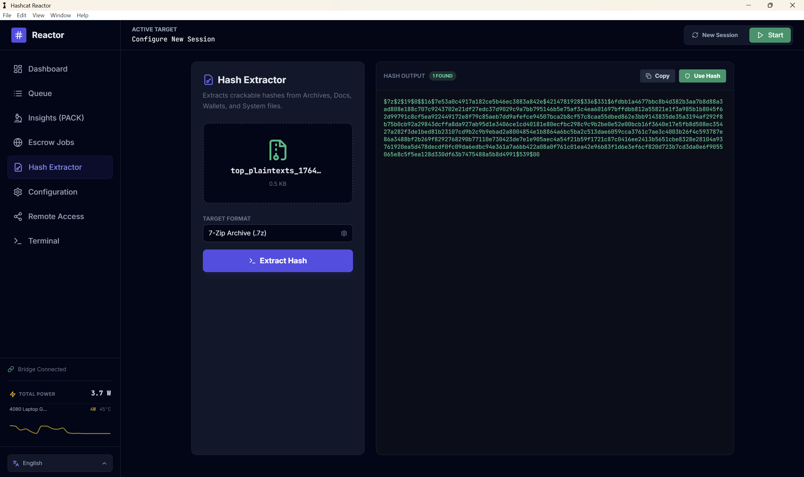 |
| *Secure remote tunneling via Zrok* | *Extract hashes from files* |

| Auto-Upload Settings | |
|:---:|:---:|
|  | |
| *Automated submission to Escrow* | |

---

## ⌚ Pebble Client (Watch Companion)

Monitor your rig from your wrist. **Hashcat Reactor** ships with a native
**Pebble** watchapp (in [`pebble-client/`](pebble-client/)) that mirrors live
telemetry over Wi-Fi/zrok → the rePebble phone app → Bluetooth LE to the watch.
It reads from the desktop bridge's read-only `GET /api/pebble/state` endpoint
and presents an animated deck of full-bleed cards you flip through with the
buttons (or swipes on touch hardware).

Built against the current **Pebble SDK 4.9.169** with **Pebble Time 2** (`emery`)
as the primary target, and also builds for the other 6 platforms (aplite,
basalt, chalk, diorite, flint, gabbro). See the
[Pebble client README](pebble-client/README.md) for SDK setup, build, and
install instructions.

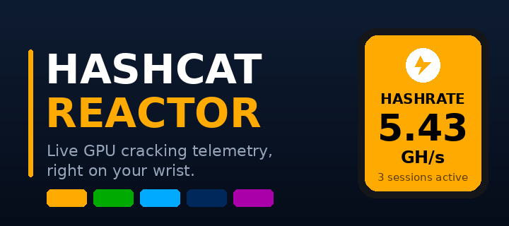

| Hashrate | Recovered | Balance |
|:---:|:---:|:---:|
| 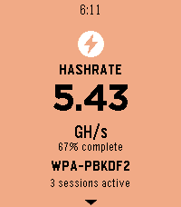 |  |  |
| *Live total hashrate* | *Recovered hashes & progress ring* | *hashes.com wallet balance* |

| Power | Insights | Sessions | Session Detail |
|:---:|:---:|:---:|:---:|
| 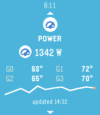 | 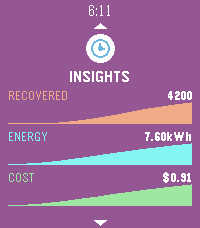 | 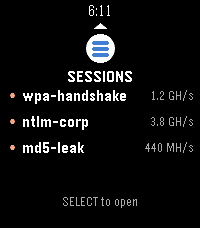 | 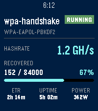 |
| *GPU power & temps* | *Crack feed* | *Per-session list* | *Drill into one session* |

**Features:**
* Live total hashrate, per-session algorithm / status / progress, recovered hashes, GPU power & temperatures, and hashes.com wallet balance (BTC / LTC / XMR + USD).
* Animated card deck with count-up heroes, progress rings, and a sliding position indicator that adapts to all 7 Pebble screen sizes (incl. round displays).
* Emery-only extras: swipe-to-refresh, plus green/red RGB backlight cues on first sync / PKJS errors.
* Configured entirely from the phone — just point it at your bridge URL (LAN or zrok).

---

## 🛠 Prerequisites

* **Operating System**: Windows 10/11 (64-bit).
* **Node.js**: Version 16.x or higher (LTS recommended).
* **Build Tools**: You generally need C++ build tools for `node-pty` to compile.
    * Run in an Admin PowerShell: `npm install --global --production windows-build-tools`.
* **Hashcat Binaries**: You must provide your own Hashcat executables.
* **Zrok (For Remote Access)**:
    * To use the **Remote Access** feature, `zrok` must be installed on your system and available in your system path.
    * You must have your zrok environment enabled using `zrok enable <token>`.
	* Visit zrok's website for installation guide https://docs.zrok.io/docs/guides/install/

---

## ⚙️ Installation & Build

This project is designed to be built for Windows.

1.  **Clone the repository**:
    ```bash
    git clone https://github.com/jjsvs/Hashcat-Reactor.git
    cd hashcat-reactor
    ```

2.  **Install Dependencies**:
    ```bash
    npm install
    ```

3.  **Configure Hashcat**:
    The application looks for Hashcat in a specific directory. You must place the binaries manually before building.
    
    1.  Create the folder structure inside the `backend` folder:
        ```
        backend/hashcat/
        ```
    2.  Download **Hashcat binaries** (v6.2.6 or higher) from the [official website](https://hashcat.net/hashcat/).
    3.  Extract the contents (specifically `hashcat.exe` and its dependencies) into `backend/hashcat/`.
    4.  Verify the path: `backend/hashcat/hashcat.exe` should exist.
	5.  V-7.1.2 is already included by default in the backend folder its upto you which version you want to use.

4.  **Build the Executable**:
    This will compile the React frontend, the backend, and package everything into a `.exe` installer.
    ```bash
    npm run electron:build
    ```
    *The output installer will be located in the `dist` folder.*.

---

## 🖥 Platform Support (Windows / Linux / macOS)

Hashcat Reactor is a GUI front-end — the actual work is done by external engines:
**hashcat** (cracking), **John the Ripper** (`*2john` hash extractors), and
**princeprocessor** (`pp64`, PRINCE attack). The backend resolves each tool
automatically per platform (`getHashcatConfig`, `getPrincePath`,
`resolveJohnTool` in `backend/server.js`): it prefers a bundled binary, and on
macOS falls back to the tool on your `PATH`.

### Windows
Everything is bundled — no extra installs.
* hashcat: `backend/hashcat/hashcat.exe`
* princeprocessor: `backend/princeprocessor/pp64.exe`
* file2john: `backend/john/win32/` (compiled `.exe` tools + PyInstaller-packaged Python/Perl tools)

Cracking still requires a working **GPU runtime/driver** (NVIDIA CUDA, AMD ROCm/Adrenalin, or Intel OpenCL).

### Linux
Binaries are bundled — no extra installs needed for the tools themselves.
* hashcat: `backend/hashcat/hashcat.bin` (v7.1.2)
* princeprocessor: `backend/princeprocessor/pp64.bin`
* file2john: `backend/john/linux/` — 6 compiled C tools (`zip2john`, `rar2john`, `gpg2john`, `putty2john`, `keepass2john`, `bitlocker2john`) + 25 cross-platform `.py`/`.pl` script tools

Prerequisites:
```bash
sudo apt install python3 perl        # for the script-based *2john tools (Debian/Ubuntu)
# GPU runtime for hashcat: NVIDIA CUDA / AMD ROCm / Intel OpenCL (or PoCL for CPU)
```

### macOS
macOS does **not** use the bundled `hashcat.bin` / `pp64.bin` — those are Linux ELF binaries and cannot run on macOS. Install the engines with **[Homebrew](https://brew.sh)** and the app picks them up from your `PATH`:
```bash
brew install hashcat       # cracking engine (Metal backend on Apple Silicon)
brew install john-jumbo    # provides zip2john, rar2john, gpg2john, etc. on PATH
# pp64 (princeprocessor): only needed for the PRINCE attack — build from source
# (https://github.com/hashcat/princeprocessor) or drop a mac `pp64` into backend/princeprocessor/
```
`python3` and `perl` ship with macOS, so the 25 script-based `*2john` tools (bundled in `backend/john/darwin/`) work out of the box; the 6 native C tools come from `brew install john-jumbo`.

> To avoid the Homebrew prerequisites, you can instead bundle native macOS (Mach-O) binaries: drop `hashcat` into `backend/hashcat/`, `pp64` into `backend/princeprocessor/`, and the 6 compiled tools into `backend/john/darwin/`. The resolver prefers a bundled binary when present.

### Building per platform
`node-pty` is a native module and **cannot be cross-compiled** — build the installer for each OS on that OS (or via a CI matrix: `windows-latest` / `macos-latest` / `ubuntu-latest`). Packaging targets are configured in `package.json` → `build` (`win`: NSIS, `mac`: dmg/zip, `linux`: AppImage/deb).

---

## 💬 Community & Support

Join our community to discuss, request features, or get help with setup.

[**Join the Discord Server**](https://discord.gg/cpAFXhGtbN)

---

## ☕ Support the Development

If Hashcat Reactor helps you in your workflow or research, consider supporting the development.

* **Bitcoin (BTC):** `bc1qwcnky8a8zwzc3kec9ptl8cwvr6lmudnzdejzc0`
* **Monero (XMR):** `42RyienngNpVtGhBMBw8F6XTZwuky5V7R7dippJbhJgjKiBk75vKmeu7zJUznxSk5C6LsyYz2Cz2XJBttSXiWLuPUhRtTpa`
* **Litecoin (LTC):** `ltc1qlc5glj4qva85rvqjs085ww6gtk55zm4kpvg4cg`

---
